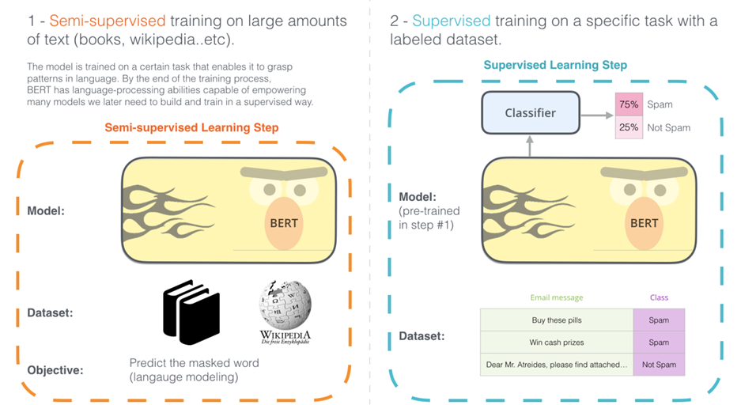
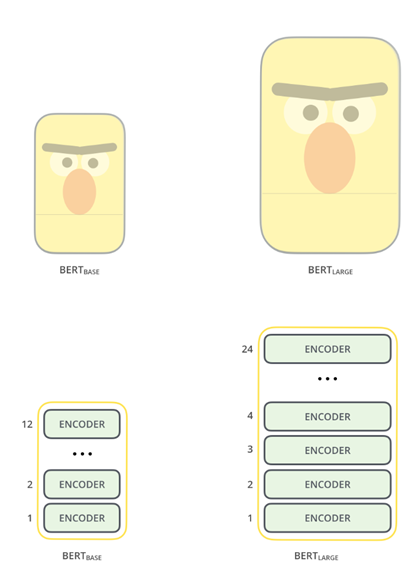
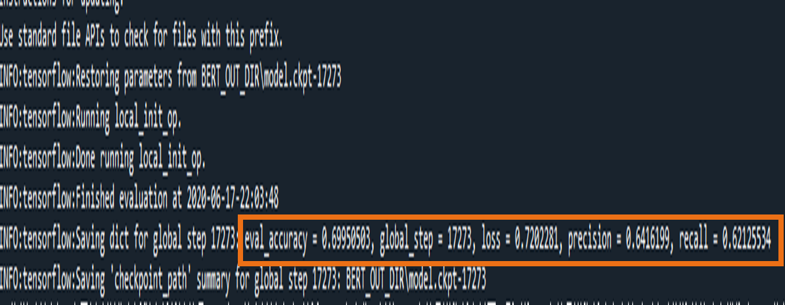

# AI project - BERT大纲

## 模型的架构

pre-train模型架构 + softmax三分类器

[Source](http://jalammar.github.io/illustrated-bert/)

[Source](http://jalammar.github.io/illustrated-bert/)

BERTBASE ：L=12,H=768,A=12（总参数为110M。和GPT一样）

模型的细节：

[模型](https://tfhub.dev/google/bert_chinese_L-12_H-768_A-12/1)

计算细节：

本地GPU： GTX 1070Ti

## 模型参数的设计

train/test划分： 

1. 抽样比例：80% / 20%
2. 是否平衡样本量：是
3. 是否对原样本进行等样本量subsample： 是(i.e. shuffle样本)

模型参数：

MAX_SEQ_LENGTH = 128

超参的设置来源于这里 [notebook](https://colab.sandbox.google.com/github/tensorflow/tpu/blob/master/tools/colab/bert_finetuning_with_cloud_tpus.ipynb) ，这些超参被google证实适用于广泛的下游任务

BATCH_SIZE = 32

LEARNING_RATE = 2e-5

NUM_TRAIN_EPOCHS = 3

(Warmup is a period of time where hte learning rate  is small and gradually increases--usually helps training.)

WARMUP_PROPORTION = 0.1

SAVE_CHECKPOINTS_STEPS = 500

SAVE_SUMMARY_STEPS = 100

## 模型的评价

假设样本为$(X_i,Y_i)$,其中$Y_i \in \{0,1,2\}$,预测的样本label为$\hat{Y_i}$

$accuracy = \frac{\sum_i I(Y_i = \hat{Y_i})}{\#TotaL\_Observations}$

$recall\_nClassifier = \frac{1}{\#Labels}\sum_{j\in\{0,1,2\}}recall(j)$

$precision\_nClassifier = \frac{1}{\#Labels}\sum_{j\in\{0,1,2\}}precision(j)$

其中 $recall(j), precision(j)$为将三分类问题变为二分类问题（label = j或label $\neq$ j）时对应的recall和precision

## 模型的结果

test data set summary

从结果认为，test模型和train模型的loss差距不大，因此在这个模型的架构下可以认为模型基本处于一个fine-fit的状态。

